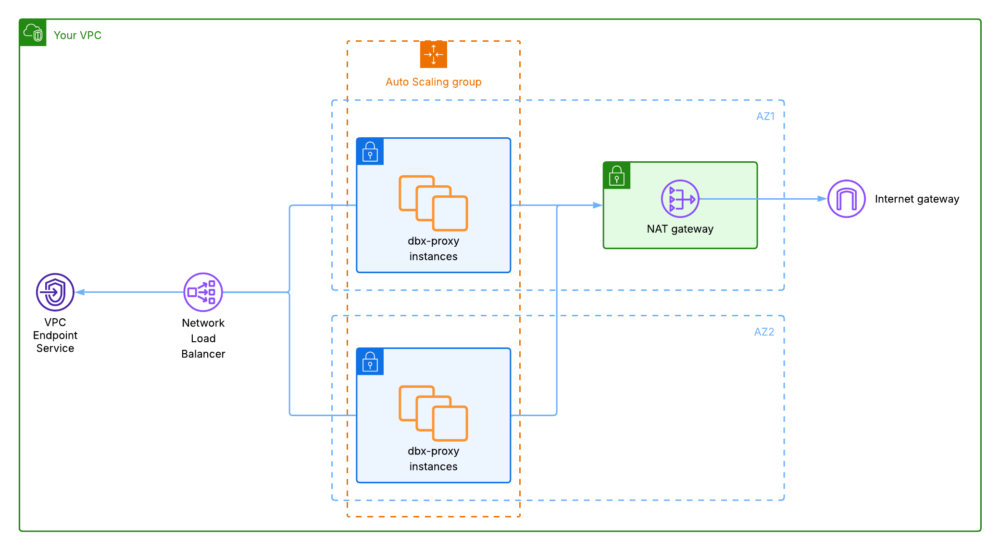

## AWS Terraform module: `dbx-proxy`

This module deploys `dbx-proxy` on AWS, using an internal Network Load Balancer (NLB) and a VPC Endpoint Service (PrivateLink) for Databricks Serverless private connectivity.

For common concepts (listener config, deployment modes, overall limitations), see the global module documentation in `terraform/README.md`.

#### Architecture



This module provisions a private Network-Load-Balancer with target groups, an endpoint service for Private Link communication from Databricks serverless, and an autoscaling-group of `dbx-proxy` instances inside your VPC.
In bootstrap-mode, the default subnets are created across availability-zones. The autoscaling-group automatically tries to balance instances across subnets and therefore availability-zones to achieve robustness.
In proxy-only mode, it is your responsibility to configure subnets accordingly.
Optional bootstrap networking creates the VPC, subnets, and NAT/IGW when not provided.

---

### Quick start

In your existing Terraform stack, add:

```hcl
module "dbx_proxy" {
  source = "github.com/databricks-solutions/dbx-proxy//terraform/aws?ref=v<release>"

  # AWS config
  region = "eu-central-1"
  tags   = {}

  # dbx-proxy config
  dbx_proxy_image_version = "<release>"
  dbx_proxy_health_port   = 8080
  dbx_proxy_listener      = []
}
```

Make sure to replace `<release>` with the actual release version!

Then run:

```bash
terraform init
terraform apply
```

After apply, use the output `load_balancer.vpc_endpoint_service_name` when creating Databricks private endpoint rules in your NCC. Also, add a domain of your choice as private endpoint rule on your NCC that you can use for troubleshooting.

---

### AWS-specific variables

| Variable | Type | Default | Description                                                                                                                                                                                                                                                                                                                                                                                                                                                                                                                                                                                          |
|---|---:|---:|------------------------------------------------------------------------------------------------------------------------------------------------------------------------------------------------------------------------------------------------------------------------------------------------------------------------------------------------------------------------------------------------------------------------------------------------------------------------------------------------------------------------------------------------------------------------------------------------------|
| `region` | `string` | (required) | AWS region to deploy to.                                                                                                                                                                                                                                                                                                                                                                                                                                                                                                                                                                             |
| `vpc_id` | `string` | `null` | Existing VPC ID. Required for `proxy-only` mode. If `null`, a VPC can be bootstrapped in `bootstrap` mode.                                                                                                                                                                                                                                                                                                                                                                                                                                                                                           |
| `subnet_ids` | `list(string)` | `[]` | Existing private subnet IDs for the NLB + ASG. Required for `proxy-only` mode. If empty, subnets can be created in `bootstrap` mode.                                                                                                                                                                                                                                                                                                                                                                                                                                                                 |
| `vpc_cidr` | `string` | `"10.0.0.0/16"` | VPC CIDR (only used when creating a VPC in `bootstrap`).                                                                                                                                                                                                                                                                                                                                                                                                                                                                                                                                             |
| `subnet_cidrs` | `list(string)` | `["10.0.1.0/24", "10.0.2.0/24"]` | Private subnet CIDRs (only used when creating subnets in `bootstrap` mode).                                                                                                                                                                                                                                                                                                                                                                                                                                                                                                                          |
| `nat_subnet_cidr` | `string` | `"10.0.0.0/24"` | Public subnet CIDR for the NAT gateway (only used when creating networking in `bootstrap` mode).                                                                                                                                                                                                                                                                                                                                                                                                                                                                                                     |
| `nlb_arn` | `string` | `null` | Existing NLB ARN to attach listeners/target groups to in `proxy-only` mode.                                                                                                                                                                                                                                                                                                                                                                                                                                                                                                                          |
| `allowed_principals` | `list(string)` | `null` | IAM principal ARNs allowed to create an interface endpoint to the PrivateLink VPC endpoint service. When `null`, defaults to the AWS commercial Databricks serverless private-connectivity role for `region` (`arn:aws:iam::565502421330:role/private-connectivity-role-<region>`). Set explicitly for other deployments, e.g. AWS GovCloud (`arn:aws-us-gov:iam::347038500609:role/private-connectivity-role-us-gov-west-1` for Civilian, `...347034940029...` for DoD). Prefer scoping to the specific connectivity role; see the security note below before using `["*"]` to allow any principal. |
| `ami_id` | `string` | `null` | AMI ID for dbx-proxy instances. When `null`, resolves the latest Amazon Linux 2023 arm64 AMI from SSM. Set to pin a specific image, e.g. a hardened/CIS golden AMI. Must match `instance_type`'s architecture.                                                                                                                                                                                                                                                                                                                                                                                       |
| `max_instance_lifetime` | `number` | `0` | Maximum lifetime, in seconds, of dbx-proxy instances before the Auto Scaling group replaces them (rolling onto the current AMI). `0` disables age-based replacement; otherwise must be between `86400` (1 day) and `31536000` (1 year). Useful for periodic patching/rotation to meet compliance mandates.                                                                                                                                                                                                                                                                                           |

Common variables are documented in `terraform/README.md`.

---

### Outputs

- `networking`: object with
  - `vpc_id`
  - `vpc_cidr`
  - `subnet_ids`
  - `subnet_cidrs`
  - `nat_gateway_id`
  - `nat_subnet_id`
  - `nat_subnet_cidr`
  - `internet_gateway_id`

- `load_balancer`: object with
  - `nlb_arn`
  - `nlb_dns_name`
  - `nlb_target_group_arns`
  - `nlb_security_group_ids`
  - `vpc_endpoint_service_arn`
  - `vpc_endpoint_service_name`

- `proxy`: object with
  - `iam_role_name`
  - `iam_role_arn`
  - `instance_profile_name`
  - `instance_profile_arn`
  - `security_group_id`
  - `autoscaling_group_name`
  - `launch_template_name`
  - `dbx_proxy_cfg`

---
### Notes for AWS users

- Multi availability-zone resilience requires subnets in multiple availability-zones and `min_capacity >= 2`. By default, the autoscaling-group spreads dbx-proxy instances across provided subnets. In `proxy-only` mode, you are responsible to configure subnets accordingly. In `bootstrap` mode, default subnets are created across multiple availability-zones in the selected region.
- `max_instance_lifetime` replaces instances on a timer, outside of any `terraform apply`. With the default single-instance topology (`min_capacity = max_capacity = 1`) the Auto Scaling group cannot launch-before-terminate, so each age-based replacement causes a brief outage when the instance is recycled. Set `min_capacity >= 2` (across multiple AZs) for zero-downtime rotation.
- `allowed_principals = ["*"]` allows **any** AWS principal to request a connection to the endpoint service. Connections still require acceptance (`acceptance_required = true`), but for a security-sensitive proxy this widens who can initiate a request. Prefer scoping `allowed_principals` to the specific Databricks connectivity role (the default), and choose `["*"]` deliberately only when you have a reason to.
